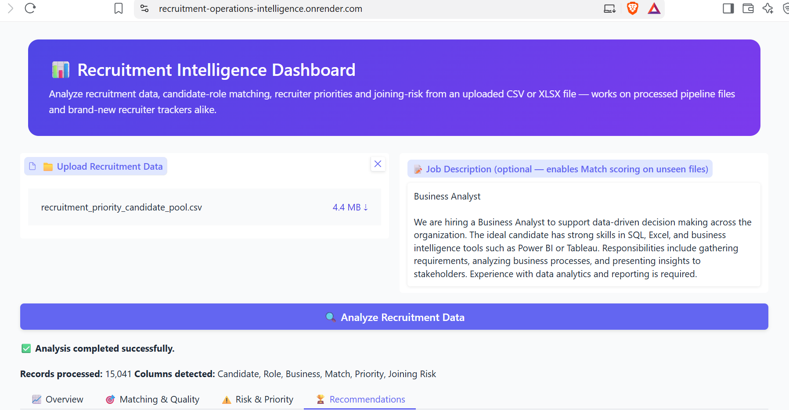
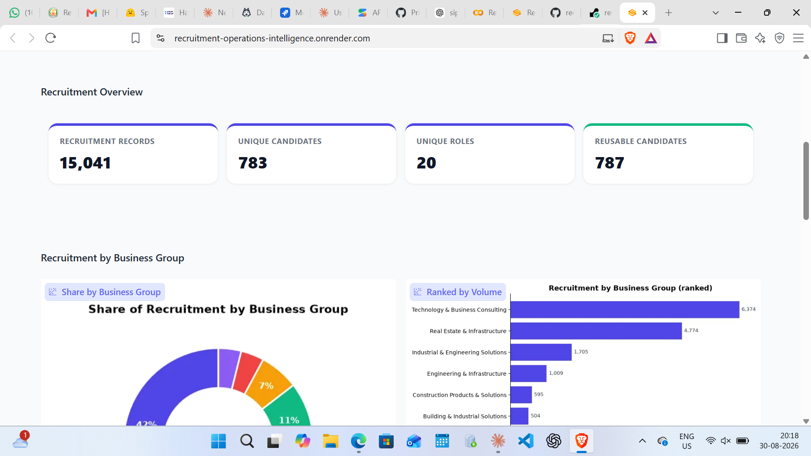
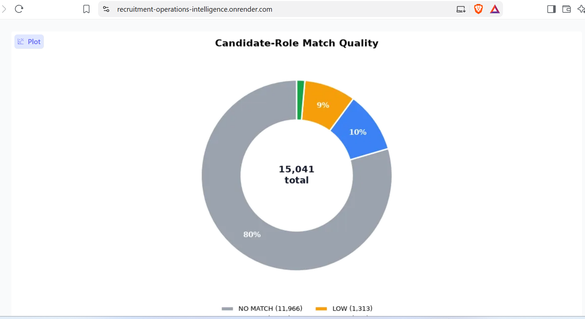
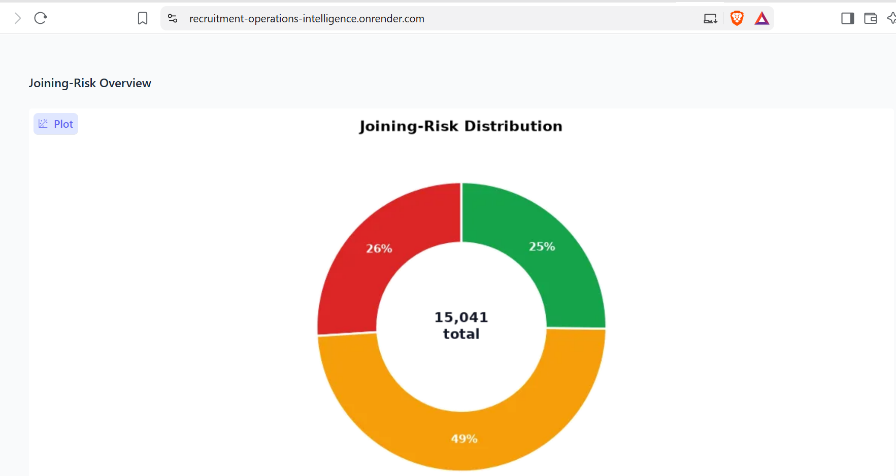
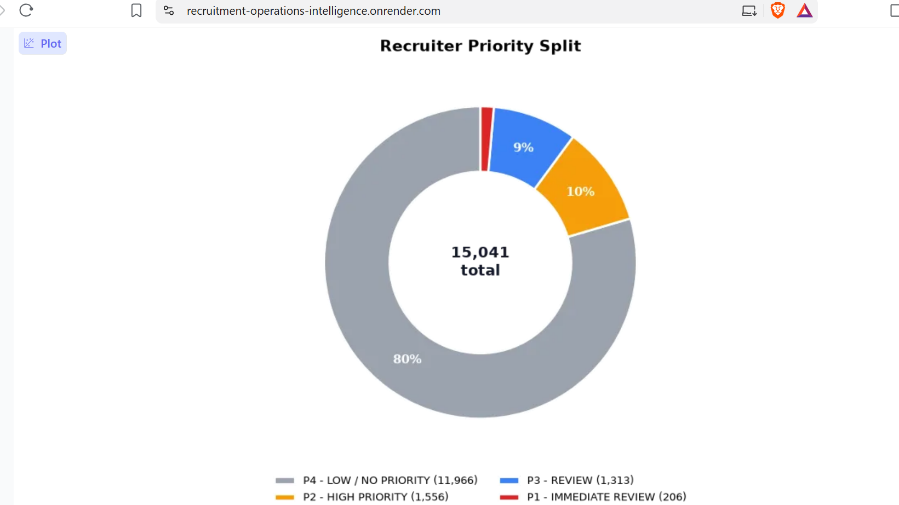
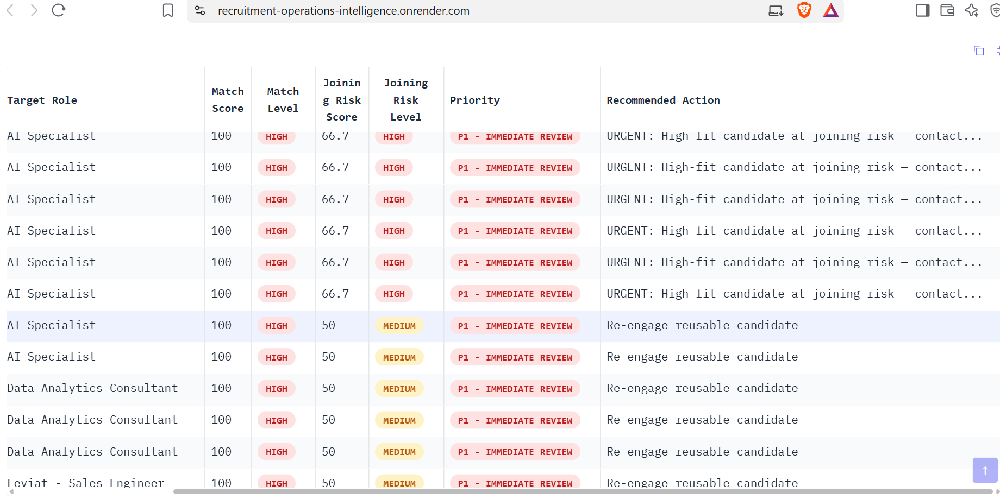

# Recruitment Operations Intelligence & Decision Support System

**Live demo:** https://recruitment-operations-intelligence.onrender.com

An end-to-end recruitment analytics platform that transforms fragmented recruiter tracking data into a unified decision-support system — candidate identity reconciliation, funnel analytics, reusable-talent detection, JD-to-candidate matching, joining-risk scoring, and recruiter prioritization, delivered through a single interactive dashboard.

---

## 1. Problem Statement

Recruitment operations at scale generate large volumes of candidate data across multiple recruiters, each maintaining independent tracking sheets with inconsistent formats and conventions. This creates four measurable operational challenges:

1. **No unified candidate view.** The same candidate can appear across multiple trackers under slightly different names or contact details, with no shared key to reconcile records. This makes it difficult to answer a basic question: how many unique candidates has the organization actually engaged?
2. **Invisible funnel leakage.** A role sourced with dozens of profiles may convert only a handful to offer, but without a structured funnel view, it is unclear at which stage — sourcing, screening, shortlisting, or interview — candidates are dropping off.
3. **Underutilized candidate pool.** A candidate rejected for one role is frequently a strong fit for a different, currently open role. Without cross-role visibility, recruiters re-source from scratch instead of re-engaging a known, already-evaluated candidate.
4. **No systematic joining-risk visibility.** An accepted offer does not guarantee a join — notice period, counter-offers, and competing offers all affect outcomes — yet there is typically no structured mechanism to flag which accepted candidates are actually at risk before their start date.

This system was scoped from a formal project requirements document that defined the target modules, the data it would operate on, and the constraints it needed to respect. That document served as the reference point throughout the build — every module below maps directly to one of the four problems above.

## 2. Solution Overview

The system is implemented as a structured analytics pipeline, validated end-to-end in a 32-step notebook, and delivered through a single deployed dashboard:

| # | Module | Addresses |
|---|---|---|
| 1 | Candidate reconciliation | Unified candidate view — merges multi-source trackers using evidence-based identity resolution (name, role, and interview-date agreement), not exact-string matching |
| 2 | Funnel & performance analytics | Funnel visibility — stage-wise conversion rates by role and by client group |
| 3 | Candidate 360° / reusable-pool detection | Candidate pool utilization — surfaces every candidate who maps to more than one role |
| 4 | JD ↔ candidate matching | Candidate pool utilization — score a new job description against the existing pool without re-sourcing |
| 5 | Joining-risk scoring | Joining-risk visibility — flags HIGH/MEDIUM/LOW risk from notice period and status signals |
| 6 | Recruiter prioritization (P1–P4) | Converts the above into a ranked, actionable worklist |
| 7 | Privacy-safe display layer | Maps identifying labels to anonymized business-group categories throughout the dashboard |
| 8 | Interactive dashboard | Delivers all of the above through a guided, tab-based interface |

## 3. Architecture

```
 Recruiter/Client tracking data (CSV/XLSX)
              │
              ▼
   CANDIDATE RECONCILIATION
   (name/email keys + evidence-based
    identity resolution: role + interview
    date agreement, not just name match)
              │
              ▼
   CENTRAL CANDIDATE DATASET
              │
   ┌──────────┼───────────────┐
   ▼          ▼               ▼
FUNNEL &   CANDIDATE 360° /  PRIVACY-SAFE
CLIENT     REUSABLE POOL     DISPLAY LAYER
PERFORMANCE (multi-role      (business-group
ANALYSIS    candidates)       anonymization)
   │          │               │
   └──────────┼───────────────┘
              ▼
      JD ↔ CANDIDATE MATCHING
      (paste a JD → rule-based
       similarity score + level)
              │
              ▼
      JOINING-RISK SCORING
      (notice period / status /
       offer signals → HIGH/MED/LOW)
              │
              ▼
   RECRUITER PRIORITIZATION
   (P1 Immediate Review → P4 Low Priority)
              │
              ▼
   INTERACTIVE DASHBOARD (app.py)
   Overview | Matching & Quality |
   Risk & Priority | Recommendations
              │
              ▼
   Deployed via CI/CD: GitHub → Render
```

## 4. Why a Rule-Based Engine, Not an LLM

- **Explainability.** A recruiter or stakeholder asking why a candidate is flagged HIGH risk needs a traceable answer (notice period + status), not a black-box embedding score. Every score in this system is explainable in one sentence.
- **Matching accuracy at this scale.** With hundreds of unique candidates across dozens of roles, structured field matching combined with text similarity (`difflib.SequenceMatcher`) delivers comparable practical accuracy to embedding-based approaches, without added latency or external dependencies.
- **No hallucination risk in hiring decisions.** A model generating a plausible-sounding justification for a risk flag is worse than no justification at all, when the flag informs a real hiring decision.
- **Deterministic, auditable scoring.** Every match score and risk flag can be recomputed identically from the same inputs, which matters when recruiters or clients ask how a number was derived.
- This is a deliberate architecture choice: an earlier iteration of this system used an LLM (via the Groq API) to generate plain-English risk explanations and outreach copy. For this version, the scoring and matching core was kept fully rule-based and auditable, with a natural-language explanation layer scoped as a future addition on top of — not a replacement for — the underlying logic.

## 5. Tech Stack

| Layer | Tool | Why |
|---|---|---|
| Language | Python | Notebook development → deployable application |
| Data processing | Pandas, NumPy | Cleaning, reconciliation, aggregation |
| Matching engine | `difflib.SequenceMatcher` | Identity resolution and JD-candidate matching — explainable, dependency-free |
| Visualization | Matplotlib | Server-rendered charts embedded in the dashboard |
| UI framework | Gradio (`gr.Blocks`) | Multi-tab, file-upload interface with no separate frontend build |
| Development environment | Google Colab | Iterative notebook development with full build history |
| Version control | Git / GitHub | `Priya2523/recruitment-operations-intelligence-dashboard` |
| Deployment | Render | Continuous deployment from GitHub on every push |

## 6. Engineering Challenges & Solutions

- **Cross-source identity resolution.** Candidate records across different trackers had no shared clean key — inconsistent name spellings, missing emails. Solved with a multi-signal resolver combining normalized name, role-text similarity, and interview-date agreement, with a confidence threshold gating a review tier rather than forcing every row into a match.
- **Threshold calibration.** An initial role-similarity gate of 0.65 rejected known-correct matches when the source role text was generic. Re-tuned to 0.35 after validating precision against a labeled set of confirmed matches.
- **Malformed source files.** Multi-sheet exports contained repeated header rows and blank separators mid-file, requiring detection and removal before any aggregate count could be trusted.
- **Privacy-safe reporting by design.** Built a mapping layer so the dashboard surfaces only anonymized business-group categories rather than identifying client labels — applied consistently across every chart and table, including ones added after the initial build.
- **Cross-platform deployment.** Notebook-hosted tunnels introduced connection-layer issues unrelated to application logic. Resolved by decoupling the deployment target from the development environment — validating the application independently, then standardizing on a GitHub-connected continuous deployment pipeline for a stable, reproducible release process.
- **Graceful handling of unseen data.** The JD-matching module checks for a pre-computed match column first, computes similarity live against a pasted JD if absent, and states plainly when neither is available — so the dashboard never silently shows an empty or misleading result.
- **Interface design for non-technical users.** Iterated from raw tables to donut charts, color-coded priority and risk badges, and auto-generated plain-language insight callouts under each chart, so a hiring manager reads the takeaway directly rather than interpreting a chart.

## 7. Results

On the current candidate pool:

- **15,041** recruitment records processed, covering **783** unique candidates across **20** roles.
- **787** candidates are reusable across more than one role — a substantial pipeline that reduces the need for new sourcing.
- **1.4%** of candidate-role pairs are HIGH-quality matches (206 of 15,041); **80%** show no match to their currently tracked role, indicating a sourcing/tagging gap rather than a candidate-quality gap.
- **26%** of candidates fall into HIGH joining-risk — the segment recruiters should prioritize for pre-offer follow-up.
- **Technology & Business Consulting** is the largest single demand center, accounting for 42% of recruitment activity.

## 8. Screenshots

All screenshots are in the [`screenshots/`](screenshots) folder.

**Landing screen** — data upload and optional JD input, supports both processed pipeline output and new tracker files


**Overview** — KPI summary and business-group distribution


**Matching & Quality — insights** — match-quality breakdown with generated insight callouts


**Matching & Quality — distribution** — candidate-role match quality donut


**Risk & Priority — joining risk** — HIGH/MEDIUM/LOW joining-risk distribution


**Risk & Priority — recruiter priority** — P1–P4 prioritization split


**Recommendations** — prioritized, color-coded candidate action table


## 9. Run Locally

```bash
git clone https://github.com/Priya2523/recruitment-operations-intelligence-dashboard.git
cd recruitment-operations-intelligence-dashboard
pip install -r requirements.txt
python app.py
```

Open `http://localhost:7860`, upload a CSV/XLSX tracker, and optionally paste a job description to run live match scoring against the existing candidate pool.

## 10. Deployment & Roadmap

- **Repository:** [`Priya2523/recruitment-operations-intelligence-dashboard`](https://github.com/Priya2523/recruitment-operations-intelligence-dashboard)
- **Deployment:** Render, with automatic redeployment on push to the main branch
- **Live application:** https://recruitment-operations-intelligence.onrender.com

**Planned enhancements:**
- Automated ingestion pipeline for multiple live recruiter trackers, replacing the current single-file upload flow
- Sourcing-channel cost and ROI tracking, once channel-level spend data is integrated
- A natural-language explanation layer on top of the existing rule-based scores, to auto-generate recruiter-facing summaries and outreach copy while keeping the scoring engine fully rule-based and auditable
- Automated recruiter outreach and messaging generation
